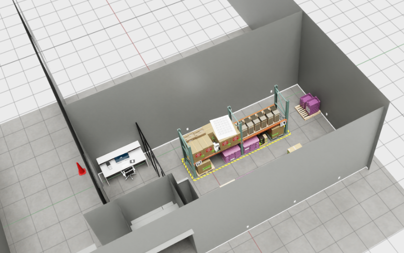
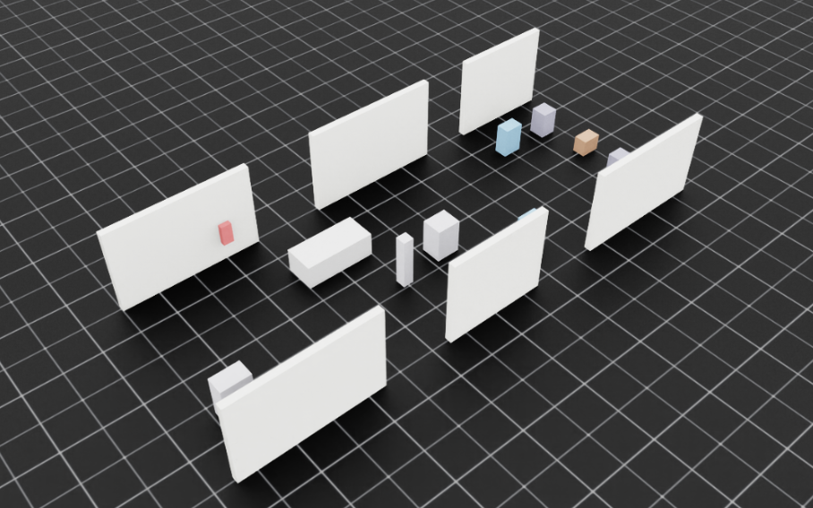

# Nepher: Universal Isaac Lab Environments Platform

[](https://www.python.org/downloads/)
[](LICENSE)

**Nepher** is a unified, category-agnostic Python package for managing Isaac Lab environments across all categories (navigation, manipulation, humanoid, locomotion, etc.). It provides a professional command-line interface and Python API for discovering, downloading, uploading, and managing environment bundles for Isaac Lab/Isaac Sim.

## Why EnvHub is Needed

Isaac Lab researchers and developers frequently need to work with diverse simulation environments across multiple categories (navigation, manipulation, humanoid, etc.). Managing these environments manually leads to several challenges:

- **Fragmented Environment Management**: Without a centralized platform, environments are scattered across repositories, making discovery and sharing difficult
- **Inconsistent Structure**: Different environment formats and structures make integration into research workflows cumbersome
- **Limited Discoverability**: Researchers struggle to find and evaluate suitable environments for their tasks
- **Version Control Issues**: Managing environment versions, dependencies, and updates becomes complex at scale
- **Repetitive Setup**: Setting up environments requires manual downloads, configuration, and path management

EnvHub addresses these challenges by providing a unified platform for environment discovery, management, and integration with Isaac Lab. It standardizes environment structures, enables easy sharing and collaboration, and simplifies the workflow from environment discovery to integration in research code.

## What is an Environment?

An **Environment** (or **env**) is a bundle containing one or more simulation scenes organized under a common theme or purpose. Each environment has:

- **Unique Identifier**: An environment ID that uniquely identifies the bundle
- **Category**: The type of environment (navigation, manipulation, humanoid, locomotion, etc.)
- **Type**: Either `usd` (USD-based scenes) or `preset` (programmatically generated scenes)
- **Metadata**: Description, version, author, and other metadata
- **Scenes**: A collection of related scenes that share the same environment context

Environments serve as containers that group related simulation scenes together, making it easier to organize, discover, and manage simulation assets.

## What is a Scene?

A **Scene** represents a single, specific simulation configuration within an environment. Each scene defines:

- **Scene Identifier**: A unique name within the environment
- **Type-Specific Configuration**: 
  - For USD scenes: A USD file path plus optional occupancy maps and metadata
  - For preset scenes: A Python configuration file that generates the scene programmatically
- **Scene-Specific Settings**: Spawn areas, exclusion zones, waypoints, and other scene-specific parameters

Scenes are the actual simulation configurations that get loaded into Isaac Lab for training or evaluation. A single environment can contain multiple scenes, allowing researchers to work with variations of similar environments.

## Installation

```bash
pip install nepher
```

## Environment and Scene Definitions

### Environment Structure

Environments are defined using a `manifest.yaml` file that describes the environment bundle:

**Example: USD Environment**
```yaml
id: digital-twin-warehouse-v1
type: usd
version: 1.0.0
description: Digital twin of a small warehouse environment for navigation training
category: navigation

scenes:
  - scene_id: small_warehouse
    description: Small warehouse digital twin with realistic layout and obstacles
    usd: small_warehouse_digital_twin.usd
    omap_image: digital_twin_omap/map.png
    omap_meta: digital_twin_omap/map.yaml
```

**Example: Preset Environment**
```yaml
id: indoor-environments-v1
type: preset
version: 1.0.0
description: Indoor navigation environments including hospital corridors and warehouse
category: navigation

preset_scenes:
  - scene_id: hospital
    description: Hospital corridor environment for indoor navigation
    preset: hospital_preset.py
  - scene_id: warehouse
    description: Warehouse with shelves and bounding walls
    preset: warehouse_preset.py
```

### Usage Example

Here's how to load and use environments and scenes in your Isaac Lab code:

```python
from nepher import load_env, load_scene

# Load an environment
env = load_env("indoor-environments-v1", category="navigation")

# List all scenes in the environment
print("Available scenes:", [s.name for s in env.get_all_scenes()])
# Output: Available scenes: ['hospital', 'warehouse']

# Load a specific scene configuration
scene_cfg = load_scene(env, scene="hospital", category="navigation")

# Use the scene configuration in Isaac Lab
from isaaclab.envs import ManagerBasedRLEnv
# ... configure your environment with scene_cfg
```

**USD Scene in Isaac Sim**


**Preset Scene in Isaac Sim**


## Quick Start

```bash
# Authenticate with your API key
nepher login <api_key>

# Check current authentication status
nepher whoami

# Logout and clear credentials
nepher logout

# List available environments
nepher list --category navigation

# Download an environment
nepher download <env_id> --category navigation

# View an environment in Isaac Sim
nepher view <env_id> --category navigation

# View a specific scene
nepher view <env_id> --category navigation --scene <scene_name>

# Upload your own environment
nepher upload ./my-env --category manipulation --thumbnail ./thumbnail.png
```

## Features

- **Universal Category Support**: Works with any environment category (navigation, manipulation, humanoid, locomotion, etc.)
- **Professional CLI**: Intuitive command-line interface for all operations
- **Seamless Integration**: Direct integration with `envhub-backend` API
- **Flexible Configuration**: User-configurable cache directories and settings


## License

MIT License - see [LICENSE](LICENSE) for details.

